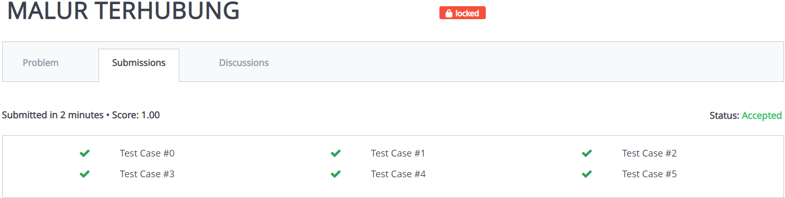
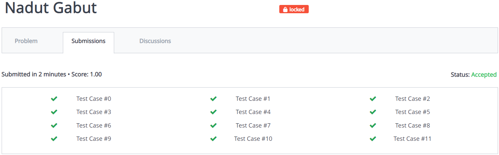

# struktur-data-h-praktikum-2-2021
## Roni Suka Merah
### Verdict
AC Perbaikan
### Bukti

### Penjelasan Soal
Diminta untuk membuat program dengan output sesuai dengan petunjuk yang diberikan
### Penjelasan Solusi
Solusi nya adalah untuk membuat traversal inorder. Traversal inorder adalah pengaksesan data dalam tree dari terkecil ke terbesar. Program mengakses left child kemudian mencetak kemudian mengakses right child.
## Genjil Ganap V2
### Verdict
AC Perbaikan
### Bukti

### Penjelasan Soal
Diminta membuat binary search tree yang isinya angka genap semua. Jika ada input ganjil, angka genap terakhir dihapus dari tree. Diminta mengeluarkan output terkecil hingga terbesar.
### Penjelasan Solusi
Program menggunakan stack untuk menyimpan trace angka genap terakhir. Pertama program mengambil jumlah testcase. Program mengambil input. Jika genap, masukkan angka ke tree dan stack. Jika ganjil, keluarkan angka (yang ada pada atas stack) dari tree, kemudian pop stack. Setelah selesai, keluarkan output secara inorder.
## Malur Terhubung
### Verdict
AC Perbaikan
### Bukti

### Penjelasan Soal
Diberikan input angka dalam tree. Untuk setiap query l dan r, outputkan hasil penjumlahan subtree yang menghubungkan l dan r (l<r). Jika l/r tidak dalam tree, outputkan ``-1``.
### Penjelasan Solusi
Untuk setiap query program:
ambil l dan r lalu ditukar l dan r jika l>r, Jika l dan r ada dalam tree. Jika tidak keluarkan -1. lalu menjalankan fungsi ``solution`` untuk mencari a,b untuk dijumlah.
## Nadut Gabut
### Verdict
AC Perbaikan
### Bukti

### Penjelasan Soal
Diberikan suatu tree, program diminta menentukan apakah ada penjumlahan tiga node terhubung yang menghasilkan jumlah tertentu sum dalam tree.
### Penjelasan Solusi
Program menggunakan fungsi bool untuk menjumlahkan tiap kombinasi 3 node terhubung dan mengecek apakah jumlahnya sebesar sum
## Banyu
### Verdict
WA
### Bukti
### Penjelasan Soal
Diberikan sebuah tree yang tiap cabang node memiliki jarak tertentu untuk melewatinya. Untuk setiap query, program diminta mencari leaf terdekat dari node tertentu.
### Penjelasan Ide
Program membuat query, lalu program menggunakan DFS untuk menghitung jarak, dan mengupdate jarak minimum & daun terdekat saat mencapai leaf. Kemudian mengoutputkan leaf terdekat.
## Penomoran Garasi Saha
### Verdict
WA
### Bukti
### Penjelasan Soal
Diberikan sebuah tree. Program diminta mendata node tree pada tingkat terbawah sampai tingkat teratas dengan pola nilai minimal, maksimal, minimal, dst.
### Penjelasan Solusi
Program diminta untuk menentukan output dengan pola min-max-min dari tingkat terbawah sampai ke atas, maka dari root ke tingkat bawah ada dua kemungkinan: Jika jumlah tingkat dalam tree h ganjil, maka dari tingkat atas ke bawah min-max-min. Jika genap maka max-min-max. Jumlah tingkat tree ditentukan melalui fungsi yang mengukur tingkat dan yang memanggil fungsi rekursi.
