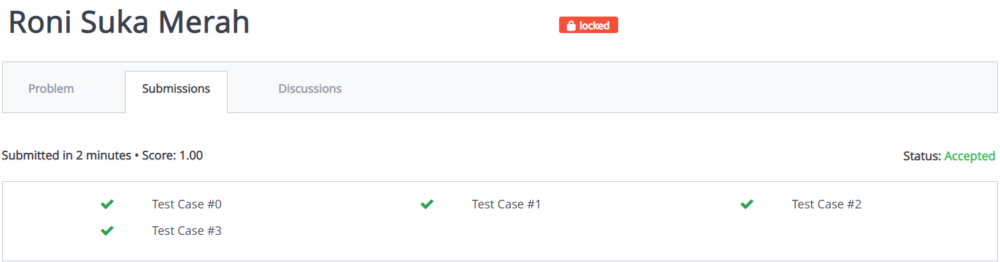
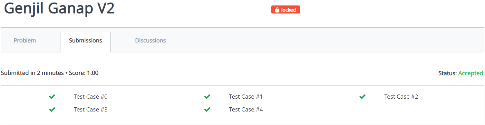

# struktur-data-h-praktikum-2-2021
## Roni Suka Merah
### Verdict
AC Perbaikan
### Bukti

### Penjelasan Soal
Diminta untuk membuat program dengan output sesuai dengan petunjuk yang diberikan
### Penjelasan Solusi
Solusi nya adalah untuk membuat traversal inorder. Traversal inorder adalah pengaksesan data dalam tree dari terkecil ke terbesar. Program mengakses left child kemudian mencetak kemudian mengakses right child.
## Genjil Ganap V2
### Verdict
AC Perbaikan
### Bukti

### Penjelasan Soal
Diberikan input angka dalam tree. Untuk setiap query l dan r, outputkan hasil penjumlahan subtree yang menghubungkan l dan r (l<r). Jika l/r tidak dalam tree, outputkan ``-1``.
### Penjelasan Solusi
Untuk setiap query program:
ambil l dan r lalu ditukar l dan r jika l>r, Jika l dan r ada dalam tree. Jika tidak keluarkan -1. lalu menjalankan fungsi ``solution`` untuk mencari a,b untuk dijumlah.
## Malur Terhubung
### Verdict
### Bukti
### Penjelasan Soal
### Penjelasan Solusi
